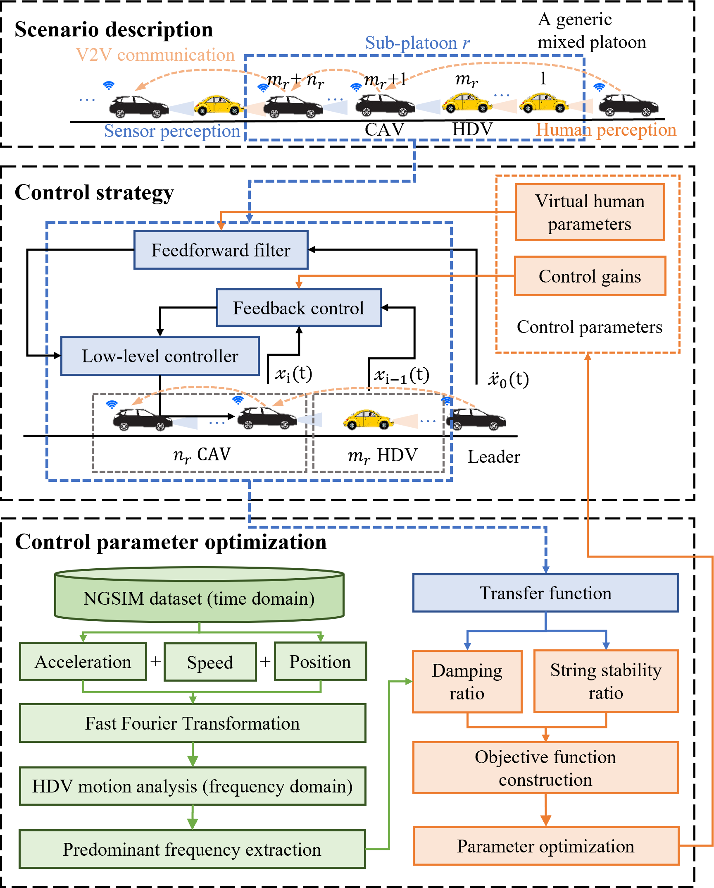

# CACCm: Cooperative Adaptive Cruise Control in a Mixed Platoon

[](https://www.mathworks.com/products/matlab.html)
[](LICENSE)

This repository contains the implementation of **Cooperative Adaptive Cruise Control in a mixed platoon (CACCm)**, a novel control framework for Connected Automated Vehicles (CAVs) in mixed traffic environments with Human-Driven Vehicles (HDVs). The proposed method enhances both adaptability across varying market penetration rates and capability in mitigating traffic oscillations.

---

## 🚀 Overview

CACCm addresses two critical challenges in mixed traffic control:

- **Adaptability**: Works across different Market Penetration Rates (MPRs) for a general platoon composition.
- **Capability**: Suppresses speed oscillations and improves string stability despite uncertain HDV behaviors.

The framework consists of two main modules:

1. **Control Strategy**  
   A feedback controller with a feedforward filter that enables a CAV to communicate with a preceding CAV even when they are separated by multiple HDVs.

2. **Parameter Optimization**  
   A frequency‑domain optimization using real HDV trajectory data (NGSIM) to maximize string stability and disturbance damping. The optimization balances the String Stability Ratio (SSR) and the Damping Ratio (DR).

The framework overview is as follows:



## 📁 Repository Structure

- `optimization.m`: Main optimization script (fmincon)
- `objectiveFcn.m`: Wrapper function for optimization solver
- `obj_function.m`: Objective function for parameter optimization
- `ablation_analysis.m`: Ablation study comparing control modules
- `sub_platoon_sim.m`: Sub‑platoon simulation (NGSIM dataset)
- `platoon_sim.m`: Full mixed platoon simulation (10 vehicles)
- Real-world trajectories from NGSIM dataset:
  - `acc_ngsim.mat` – acceleration trajectories
  - `vel_ngsim.mat` – velocity trajectories
  - `pos_ngsim.mat` – position trajectories

## 🔧 Requirements

- **MATLAB** R2021b or later
- **Optimization Toolbox** (for `fmincon`)
- **Signal Processing Toolbox** (for FFT operations)

## 📄 Citation

This study is accepted by IEEE Transactions on Intelligent Transportation Systems.
``` bibtex
@article{xiong2026CACCm,
  title={A Control Framework for Stabilizing a Mixed Platoon with Connected Automated Vehicles},
  author={Xiong, Zhuozhi and Wang, Hao and Zhang, Jiarui and Han, Gengyue and Wang, Feng and Li, Ni and Dong, Changyin},
  journal={IEEE Transactions on Intelligent Transportation Systems},
  year={2026},
  publisher={IEEE},
  note={Accepted}
}
```
